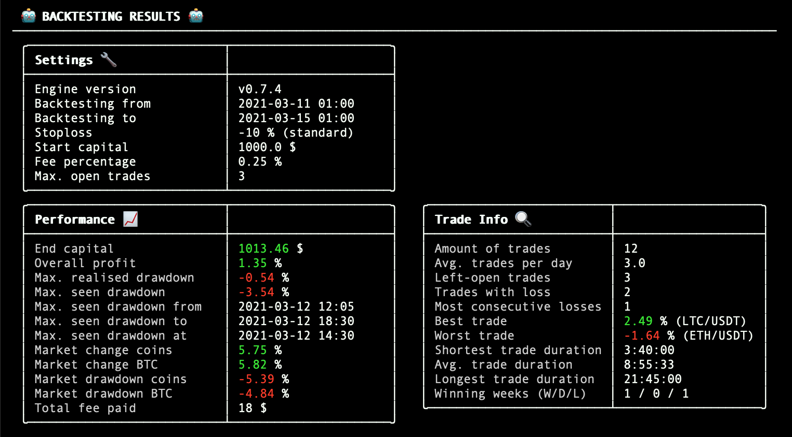
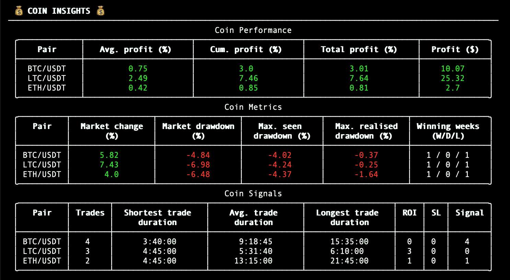
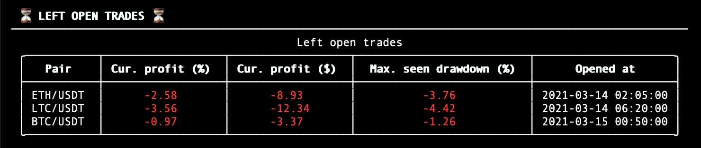

# Results
## Backtesting Results


### Settings
Shows the configuration as defined in the ```config.json```.

### Performance
This table shows the performance of the strategy on portfolio level. 
* **End capital**: total amount of capital at the end of backtesting period. This capital is the 
  sum 
  of the budget (USDT that can be used to get in position) and the total amount of USDT in open 
  trades.
  
* **Overall profit**: total profit percentage.

* **Max. realised drawdown**: see 
  [Termsheet](https://docs.dematrading.ai/getting_started/trading101/termsheet/#realised-drawdown).
  
* **Max. seen drawdown**: see 
  [Termsheet](https://docs.dematrading.ai/getting_started/trading101/termsheet/#seen-drawdown).
  
* **Max. seen drawdown from**: starting date of the drawdown period where the max. seen drawdown 
  occured.
  
* **Max. seen drawdown to**: end date of the drawdown period where the max. seen drawdown occured.
  
* **Max. seen drawdown at**: date at which the max. seen drawdown occured.
  
* **Market change coins**: average marketchange of the whitelisted trading pairs within the 
  backtesting period.
  
* **Market change BTC**: marketchange BTC/USDT within the backtesting period.
  
* **Market drawdown coins**: max. seen drawdown of market change coins.
  
* **Market drawdown BTC**: max. seen dradown of marketchange BTC/USDT.
  
* **Total fee paid**: summed total of all payed fees (also includes open trade fees)

### Trade Info
This table shows the trade information combined over all whitelisted pairs.
* **Amount of trades**: total number of trades the strategy has been able to open and close.
  
* **Avg. trades per day**: average amount of trades the strategy has performed per day.
  
* **Left-open trades**: total amount of left open trades.
  
* **Trades with loss**: total amount of trades that have closed with a negative profit percentage.
  
* **Most consecutive losses**: maximum number of trades that closed in succession with each 
  trade having a negative profit percentage (combined over all whitelisted pairs).
  
* **Best trade**: trade with the highest profit percentage.
  
* **Worst trade**: trade with the lowest profit percentage.
  
* **Shortest trade duration**: trade with the shortest duration between opening and closing.
  
* **Avg. trade duration**: average duration between opening and closing a trade.
  
* **Longest trade duration**: trade with the longest duration between opening and closing.
  
* **Winning weeks (W/D/L)**: amount of weeks where the profits from the strategy outperformed the 
  BTC/USDT marketchange. W/D/L indicating how many weeks where labeled as Wins, Losses and Draws 
  respectively.

## Coin Insights

### Coin Performance
This table shows the performance of the strategy on coin level.
* **Avg. profit (%)**: Average profit percentage over all trades.

* **Cum. profit (%)**: Cumulative profit percentage over all trades. Here, we define cumulative 
  as the sum over all trade profit percentages.

* **Total profit (%)**: Total profit percentage over all trades. This is defined as the product 
  over all trade profit percentages.

* **Profit ($)**: Total amount of profit in USDT over all trades. For calculating the profit (in 
  USDT) for a particular pair, the fee for both opening and closing a trade is substracted from 
  the profit.

### Coin Metrics
This table shows important metrics for each pair.
* **Market change (%)**: market change for the corresponding pair.

* **Market drawdown (%)**: max. seen drawdown of the market change.

* **Max. seen drawdown (%)**: max. seen drawdown for all closed trades.

* **Max. realised drawdown (%)**: max. realised drawdown for all closed trades.

* **Winning weeks (W/D/L)**: see [Trade Info](#Trade Info).


### Coin Signals
This table shows information about the performed trades.
* **Trades**: number of trades the corresponding pair has been able to open and close.

* **Shortest trade duration**: see [Trade Info](#Trade Info).

* **Avg. trade duration**: see [Trade Info](#Trade Info).

* **Longest trade duration**: see [Trade Info](#Trade Info).

* **ROI**: amount of times a trade has been closed because of ROI.

* **SL**: amount of times a trade has been closed because of stoploss.

* **Signal**: amount of times a trade has been close because of a strategy sell signal.

## Left Open Trades

* **Cur. profit (%)**: current profit percentage of the open trade.

* **Cur. profit ($)**: current profit in USDT of the open trade.

* **Max. seen drawdown (%)**: max. seen drawdown of the open trade.

* **Opened at**: time at which the trade has been opened.

