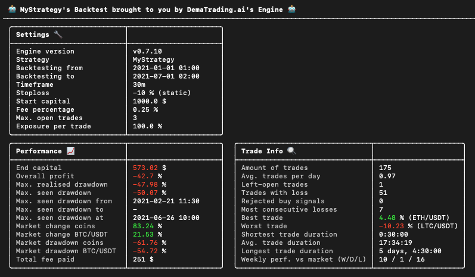
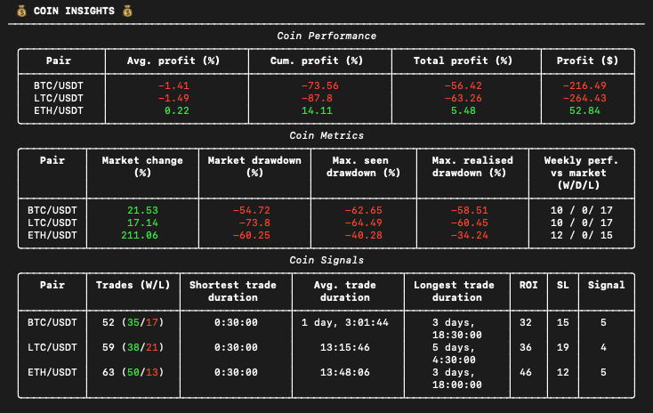
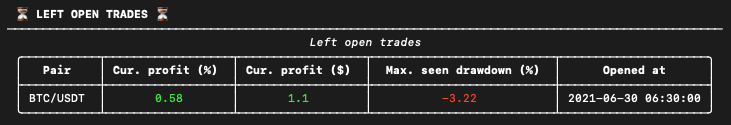
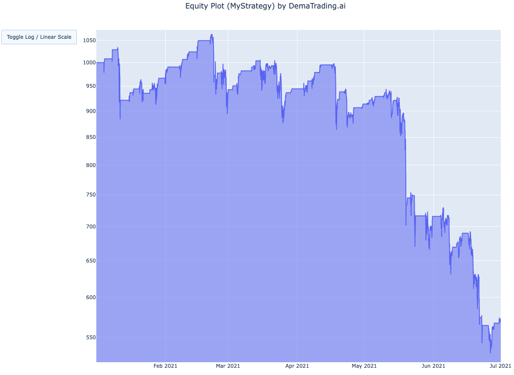

---
hide:
  - toc
---
# Results Explained

Now that you have a good grasp of the basics of the sample strategy, it is time to test it out by running a backtest.
Once you have installed the Engine following the instructions in
[Section 1.1: Installation](/installation_and_updating/installation), simply navigate to the folder where you created
your project, and run the command ‘engine’. This will run the Engine, and you will be presented with the results of
your strategy. The results are divided into a few categories. The first one is: the Main Results.

## Main Results
 <br>
This is how the first section of your results look like. The Main Results are divided into three separate tables:
Settings, Performance, and Trade Info.

### Settings
This table shows the settings that you used while testing your algorithm. If you are unsure what the different
settings mean, we explain them in
[Section 2.5: Editing Your Configuration](/your_first_strategy/editing_your_configuration).

### Performance
This table shows the performance of the strategy (on portfolio level, so not divided by coin pair). A brief
explanation of each of the terms used:

* **End capital**: total amount of capital at the end of backtesting period. This capital is the sum of your current
budget (the available funds that can be used to start new trades) and the total worth of your open trades (converted
to your base currency).
* **Overall profit**: total profit percentage (100 * starting capital / end capital)
* **Max. realised drawdown**: for a more detailed explanation, see the [Termsheet](/knowledge_library/term_sheet/#realised-drawdown).
* **Max. seen drawdown**: for a more detailed explanation, see the [Termsheet](/knowledge_library/term_sheet/#seen-drawdown).
* **Max. seen drawdown from**: the starting date of the drawdown period where the max. seen drawdown occurred.
* **Max. seen drawdown to**: the end date of the drawdown period where the max. seen drawdown occurred. If this is a
‘-’ instead of a date, that means that the drawdown period has not yet ended when the backtest concluded.
* **Max. seen drawdown at**: the specific date and time at which the max. seen drawdown occurred.
* **Market change coins**: the average market change of the whitelisted trading pairs within the backtesting period.
* **Market change BTC**: the market change of the pair BTC/USDT within the backtesting period.
* **Market drawdown coins**: max. seen drawdown of the market change of the whitelisted trading pairs.
* **Market drawdown BTC**: max. seen drawdown of the market change of the pair BTC/USDT.
* **Total fee paid**: summed total of all paid fees (including open trade fees)

### Trade Info
This table shows the trade information combined over all whitelisted pairs. A brief explanation of each of the
terms used:


* **Amount of trades**: total number of times the strategy has opened (buy) and closed (sell) a trade. Left-open
trades (trades that are bought but not sold yet, by the time the backtesting period ended) are not counted in this.
* **Avg. trades per day**: average amount of trades the strategy has performed per day.
* **Left-open trades**: total amount of trades which were opened but not closed.
* **Trades with loss**: total amount of trades that have closed with a negative profit percentage.
* **Most consecutive losses**: maximum number of trades that closed in succession with each trade having a negative
profit percentage (combined over all whitelisted pairs).
* **Best trade**: profit percentage of the trade with the highest profit percentage.
* **Worst trade**: profit percentage of the trade with the lowest profit percentage.
* **Shortest trade duration**: duration of the trade with the shortest duration between opening and closing.
* **Avg. trade duration**: average duration between opening and closing a trade.
* **Longest trade duration**: duration of the trade with the longest duration between opening and closing.
* **Weekly perf. vs market (W/D/L)**: amount of weeks in which the profits from the strategy outperformed the average
marketchange for whitelisted trading pairs. W/D/L indicating how many weeks were labeled as Wins, Losses, and Draws
respectively.

## Coin Insights
 <br>
Underneath the Main Results section is the Coin Insights section. This section shows the results of the trading
strategy, separated per whitelisted coin. This can give you a good insight into how your strategy performance
differs between coins.

### Coin Performance
The first table in the Coin Insights section is the Coin Performance table. This shows the performance of the
strategy on coin level. A brief description of the terms used:

* **Avg. profit (%)**: the average profit percentage over all trades for that coin.
* **Cum. profit (%)**: the cumulative profit percentage over all trades for that coin. Here, we define cumulative
as the sum over all trade profit percentages.
* **Total profit (%)**: Total profit percentage over all trades for that coin. This is defined as the product over
all trade profit percentages.
* **Profit ($)**: Total amount of profit in USDT over all trades for that coin. For calculating the profit (in USDT)
for a particular pair, the fee for both opening and closing a trade is subtracted from the profit.

### Coin Metrics
The second table in the Coin Insights section is the Coin Metrics table. This table shows important metrics for
each pair. 

* **Market change (%)**: the market change for the corresponding pair.
* **Market drawdown (%)**: the max. seen drawdown of the market change for the corresponding pair.
* **Max. seen drawdown (%)**: the max. seen drawdown for all closed trades for that pair.
* **Max. realised drawdown (%)**: max. realised drawdown for all closed trades for that pair .
* **Weekly perf. vs market (W/D/L)**: amount of weeks in which the profits for that pair from the strategy
outperformed the average market change for that pair. W/D/L indicating how many weeks were labeled as Wins, Losses,
and Draws respectively.

### Coin Signals
The third and final table in the Coin Insights section is the Coin Signals table. This table shows information about
the trades closed for each pair.

* **Trades (W/L)**: number of trades the corresponding pair has been able to open and close. The (W/L) numbers
indicate the amount of trades closed with a positive and a negative profit margin, respectively.
* **Shortest trade duration**: duration of the trade with the shortest duration between opening and closing.
* **Avg. trade duration**: average duration between opening and closing a trade.
* **Longest trade duration**: duration of the trade with the longest duration between opening and closing.
* **ROI**: amount of times a trade has been closed because of the profit margin reaching (one of the) the specified
ROI level(s).
* **SL**: amount of times a trade has been closed because of the profit margin dipping beneath the specified stoploss.
* **Signal**: amount of times a trade has been closed because of a strategy sell signal.

## Left Open Trades
 <br>
The final section of the Backtesting Results is the Left Open Trades section. This section shows the intermediate
results of the trades that were not closed by the time the backtesting period ended. If there were no open trades
at the end of the backtesting period, this table will be empty.

* **Cur. profit (%)**: the current profit percentage of the open trade.
* **Cur. profit ($)**: the current profit in USDT of the open trade.
* **Max. seen drawdown (%)**: the current max. seen drawdown of the open trade.
* **Opened at**: the date and time at which the trade has been opened.

## Plots
If you want a more detailed view of how your algorithm performed over time, you can find two categories of plots
that can help you achieve that. After you run the Engine for the first time, the plots will be located in the folder
DIRECTORY_NAME/data/backtesting-data/plots.

### Coin Plot
 <br>
The coin plots are located directly in the plots folder, and are named plotPAIRNAME.html (for example the BTC/USDT
Plot is in the file plotBTCUSDT.html). The plot shows the fluctuation of the value of the coin. If you zoom in, you
can see the OHLC candle for each timestep. The bottom graph by default shows the volume of the coin at each timestep.
You can add or change any indicators shown in these plots, by changing your config file. Find out how to do that in
[Section 2.5: Editing Your Configuration](/your_first_strategy/editing_your_configuration).

### Equity Plot
 <br>
The equity plot can be found in the plots/equity folder. This graph shows the capital of your trading algorithm over
time. The horizontal parts of the graph signify moments where the algorithm had no trades open.

## Trade Logs
If you need an even more detailed insight into the behaviour of the trading algorithm, you can take a look at the
trades log. This is where all trades of the algorithm are logged in json format. You can find the trades log in the
following file: DIRECTORY_NAME/data/backtesting-data/trades_log.json. One single trade in the trades log looks
like this:

```json
"1": {
   "status": "closed",
   "opened_at": "2021-01-04 10:30:00",
   "closed_at": "2021-01-04 15:30:00",
   "pair": "BTC/USDT",
   "open_price": 31038.63,
   "close_price": 31969.788900000003,
   "fee_paid": 0.0025,
   "starting_amount": 333.3333333333333,
   "capital": 341.61881250000005,
   "currency_amount": 0.01071245734750535,
   "sell_reason": "SellReason.ROI"
}
```

This includes the following statistics:

* **Status**: Open or Closed - signifies the current status of the trade.
* **Opened at**: The date and time the trade was opened.
* **Closed at**: The date and time the trade was closed. Will be null when the trade is still open.
* **Pair**: The pair that was traded.
* **Open price**: The price in base currency on the moment the trade was opened
* **Close price**: The price in base currency on the moment the trade was closed. Will be null when the trade is still
open.
* **Fees paid**: The amount that was paid in buy- and sell-fees.
* **Starting amount**: The amount of base currency that the trade was worth when it was opened.
* **Capital**: The amount of base currency that the trade was worth when it was sold, or the current amount that it
was worth at the end of the backtesting period, if trade is still open.
* **Currency amount**: The amount of the Crypto currency that was bought in the trade.
* **Sell reason**: The reason why the trade was closed. Can be one of the following: SELL_SIGNAL (when it was closed
because a sell signal was sent), ROI (when it was closed because one of the ROI targets was hit), STOPLOSS (when it
was closed because the stoploss was hit), or NONE (when the trade is still open).
